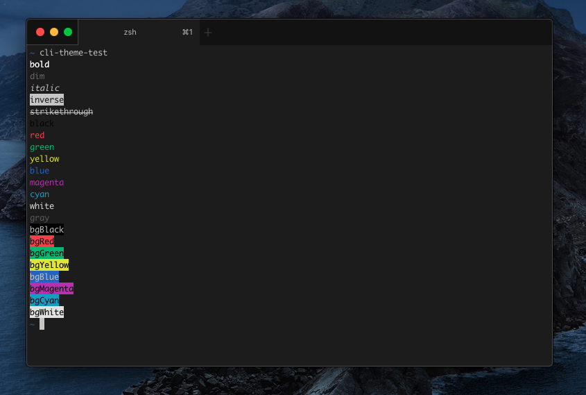

iTerm2 - VS Dark+
=================

A port of [VS Code](https://github.com/microsoft/vscode) default theme Dark+.

Install
-------

- Right-click [`VS Dark+.itermcolors`]() and choose `Save Link As…`.
- Double-click the downloaded file.

Color Reference
---------------

| Text          | Foreground | Background |
|---------------|:----------:|:----------:|
| Default Text  | `#cccccc`  | `#1e1e1e`  |
| Selected Text | `#ffffff`  | `#555555`  |

| Color   | Normal    | Bright    |
|---------|:---------:|:---------:|
| Black   | `#000000` | `#666666` |
| Red     | `#e94a51` | `#e94a51` |
| Green   | `#37be78` | `#45d38a` |
| Yellow  | `#e2e822` | `#f2f84a` |
| Blue    | `#396ec7` | `#4e8ae9` |
| Magenta | `#b835bc` | `#d26ad6` |
| Cyan    | `#3ba7cc` | `#49b7da` |
| White   | `#e5e5e5` | `#e5e5e5` |
